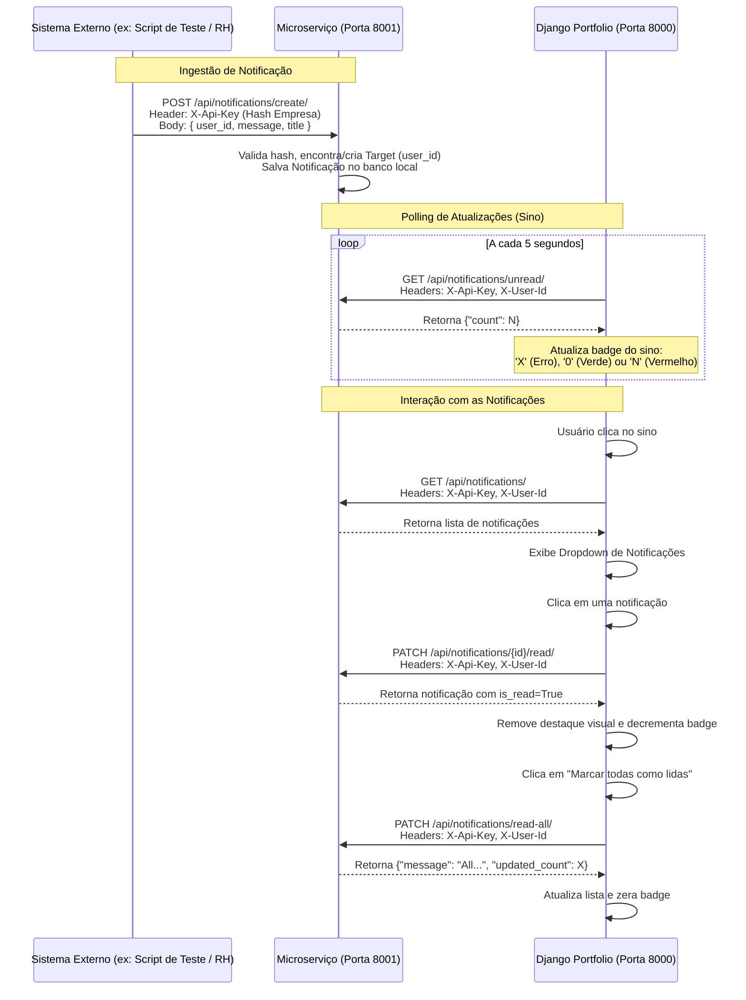

# Sistema de Portfólio com Microsserviço de Notificações

Este projeto consiste em uma solução integrada composta por dois sistemas independentes que se comunicam via APIs REST: um **Portfólio Pessoal Acadêmico** e um [**Microsserviço de Notificações**](https://github.com/jonasr1/notification_microservice) genérico.

A integração permite que sistemas externos ou administradores enviem notificações direcionadas a usuários específicos e que o Portfólio consuma e gerencie essas notificações em tempo real na interface (através de um sino de notificações com atualização dinâmica via *polling*).

---

## Arquitetura do Sistema

A solução é dividida em dois repositórios/diretórios totalmente independentes, simulando uma arquitetura real de microsserviços onde cada componente possui seu próprio banco de dados SQLite e configurações próprias:

1. **Django Portfolio (Porta 8000):** Aplicação principal baseada em Django com templates clássicos de frontend (Início, Projetos, Contato) e endpoints de API com autenticação JWT.
2. **Notification Microservice (Porta 8001):** Serviço especializado e isolado para centralizar a criação, contagem e gerenciamento de status de leitura de notificações para qualquer sistema cadastrado (empresas/clientes). Repositório disponível no [GitHub](https://github.com/jonasr1/notification_microservice).

### Diagrama de Comunicação

Abaixo está o fluxo de comunicação entre os sistemas:



---

## Funcionalidades

### 1. Django Portfolio
* **Páginas de Frontend:**
  * **Início:** Exibe informações do perfil acadêmico do usuário (foto, curso, período) e certificados cadastrados.
  * **Projetos:** Lista projetos acadêmicos e pessoais com descrições e links de repositório.
  * **Contato:** Exibe informações de contato e redes sociais (GitHub, LinkedIn, E-mail).
* **API REST:**
  * Endpoint autenticado por JWT para visualização e atualização dos dados do perfil (`/api/profile/`).
* **Sino de Notificações Integrado:**
  * Sino visível no menu de navegação para usuários autenticados (ou com JWT no `localStorage`).
  * Atualização dinâmica (polling) do total de mensagens não lidas a cada 5 segundos.
  * Dropdown para listar e ler notificações.
  * Ação rápida para marcar todas como lidas.

### 2. Notification Microservice
* **Autenticação Customizada:**
  * Validação baseada exclusivamente nos cabeçalhos HTTP `X-Api-Key` (identifica a empresa cliente) e `X-User-Id` (identifica o usuário do sistema parceiro).
  * Criação automática de alvos (*Targets*) sob demanda ao consultar ou criar notificações.
* **Gerenciamento de Notificações:**
  * Envio de notificações via API por sistemas externos autorizados.
  * Consulta de quantidade de mensagens não lidas.
  * Listagem de mensagens de um usuário (com suporte a filtros por status de lida/não lida).
  * Alteração do status para lida individualmente ou em lote para o usuário.
* **Painel Administrativo:**
  * Interface administrativa Django para cadastrar empresas, ver chaves de API auto-geradas e gerenciar notificações.

---

## Tecnologias Utilizadas

* **Linguagem:** Python (>= 3.12)
* **Framework Web Principal:** Django (5.2 no portfólio, >= 6.0.6 no microserviço)
* **Biblioteca API REST:** Django REST Framework (DRF) (>= 3.17.1)
* **Autenticação de API (Portfólio):** Django REST Framework SimpleJWT (>= 5.5.1)
* **Segurança de Origem (CORS):** Django CORS Headers (no microserviço)
* **Configurações Dinâmicas:** Python Decouple (leitura de arquivos `.env`)
* **Banco de Dados:** SQLite (bancos locais independentes)
* **Front-end do Portfólio:** HTML5, CSS3 nativo e Javascript assíncrono (Fetch API)
* **Ferramenta de Gerenciamento Python:** `uv` (empacotador rápido) e `pip` tradicional

---

## Pré-requisitos

Para executar os projetos localmente, você precisa ter instalado na sua máquina:

1. **Python (versão >= 3.12)**
2. **Git** (para versionamento/clone)
3. **uv** (opcional, recomendado para gerenciamento ultrarrápido de pacotes e ambientes virtuais) ou **pip** (gerenciador de pacotes nativo do Python)

---

## Estrutura do Projeto

A estrutura de diretórios simplificada de ambos os projetos é apresentada a seguir:

```text
django/
├── django_portifolio/           <-- Repositório do Portfólio (Porta 8000)
│   ├── core/
│   │   ├── static/core/         <-- Estilos CSS e scripts JS do sino
│   │   │   ├── css/styles.css
│   │   │   └── js/notifications.js
│   │   ├── templates/core/
│   │   │   └── base.html        <-- Template base contendo a estrutura HTML do sino
│   │   ├── context_processors.py <-- Context processor para disponibilizar URLs do microserviço
│   │   ├── settings.py          <-- Configuração geral e leitura do .env
│   │   └── urls.py
│   ├── portfolio/
│   │   ├── models.py            <-- Models: Certificate, Project
│   │   ├── serializers.py
│   │   ├── urls/                <-- URLs divididas entre Web e API
│   │   │   ├── api.py
│   │   │   └── web.py
│   │   └── views/               <-- Views divididas entre Web e API
│   │       ├── api.py
│   │       └── site.py
│   ├── manage.py
│   ├── pyproject.toml
│   └── uv.lock
│
└── notification_microservice/   <-- Repositório do Microserviço (Porta 8001)
    ├── core/
    │   ├── settings/            <-- Configurações modulares (apps, auth, cors, middleware)
    │   │   ├── base.py
    │   │   ├── cors.py
    │   │   └── local.py
    │   └── urls.py
    ├── notifications/
    │   ├── admin.py             <-- Configuração do painel admin (Company, Target, Notification)
    │   ├── authentication.py    <-- Lógica de validação dos headers X-Api-Key e X-User-Id
    │   ├── models.py            <-- Models: Company, Target, Notification
    │   ├── serializers.py
    │   ├── urls.py
    │   └── views.py             <-- Lógica dos endpoints do microserviço
    ├── scripts/
    │   └── send_notification.py <-- Script de simulação de envio
    ├── manage.py
    ├── pyproject.toml
    └── uv.lock
```

---

## Instalação e Configuração

Escolha uma das opções abaixo para configurar o ambiente e instalar as dependências de cada projeto. Os comandos devem ser executados no terminal de maneira separada para o **Portfólio** e para o **Microserviço**.

---

### Opção 1 — Utilizando `uv` (Recomendado)

O `uv` gerencia pacotes de forma extremamente veloz e cuida do ambiente virtual automaticamente.

#### 1.1 Configurando o Django Portfolio
Abra um terminal na pasta do portfólio:
```bash
cd django_portifolio

# Cria o ambiente virtual utilizando a versão do Python configurada no projeto
uv venv

# Ativa o ambiente virtual
source .venv/bin/activate

# Instala todas as dependências do projeto (incluindo grupos de desenvolvimento)
uv sync

# Cria o arquivo de variáveis de ambiente com base no exemplo
cp .env.example .env
```
*(Nota: Edite o arquivo `.env` gerado. Veja a seção de variáveis de ambiente abaixo para detalhes de preenchimento)*.

```bash
# Executa as migrações para inicializar o banco de dados local SQLite
uv run python manage.py migrate

# Cria um superusuário administrativo para gerenciar o portfólio
uv run python manage.py createsuperuser
```

#### 1.2 Configurando o Notification Microservice
Abra um segundo terminal na pasta do microserviço:
```bash
cd notification_microservice

# Cria o ambiente virtual
uv venv

# Ativa o ambiente virtual
source .venv/bin/activate

# Instala todas as dependências
uv sync

# Cria o arquivo de variáveis de ambiente com base no exemplo
cp .env.example .env
```
*(Nota: Edite o arquivo `.env` gerado. Veja a seção de variáveis de ambiente abaixo para detalhes de preenchimento)*.

```bash
# Executa as migrações para inicializar o banco de dados do microserviço
uv run python manage.py migrate

# Cria o superusuário para acessar o painel admin do microserviço
uv run python manage.py createsuperuser
```

---

### Opção 2 — Utilizando `pip` (Tradicional)

Caso prefira utilizar as ferramentas nativas do ecossistema Python.

#### 2.1 Configurando o Django Portfolio
Abra um terminal na pasta do portfólio:
```bash
cd django_portifolio

# Cria o ambiente virtual padrão
python -m venv .venv

# Ativa o ambiente virtual
source .venv/bin/activate

# Atualiza o pip e instala as dependências especificadas no pyproject.toml
pip install --upgrade pip
pip install -e .

# Cria o arquivo de variáveis de ambiente com base no exemplo
cp .env.example .env
```
*(Nota: Edite o arquivo `.env` gerado)*.

```bash
# Executa as migrações do banco de dados
python manage.py migrate

# Cria o superusuário do portfólio
python manage.py createsuperuser
```

#### 2.2 Configurando o Notification Microservice
Abra um segundo terminal na pasta do microserviço:
```bash
cd notification_microservice

# Cria o ambiente virtual
python -m venv .venv

# Ativa o ambiente virtual
source .venv/bin/activate

# Instala as dependências
pip install --upgrade pip
pip install -e .

# Instala dependências de dev adicionais necessárias para rodar o script de envio
pip install requests

# Cria o arquivo de variáveis de ambiente
cp .env.example .env
```
*(Nota: Edite o arquivo `.env` gerado)*.

```bash
# Executa as migrações do banco de dados
python manage.py migrate

# Cria o superusuário do microserviço
python manage.py createsuperuser
```

---

## Configuração das Variáveis de Ambiente

Cada projeto possui um arquivo `.env` na sua respectiva raiz com configurações cruciais de segurança e conectividade.

### 1. Django Portfolio (`django_portifolio/.env`)

| Variável | Descrição | Valor Padrão/Exemplo |
|---|---|---|
| `SECRET_KEY` | Chave de segurança usada pelo Django para assinaturas criptográficas e JWT. | `django-insecure-...` |
| `DEBUG` | Define o modo de depuração. Deve ser `True` em desenvolvimento e `False` em produção. | `True` |
| `NOTIFICATION_MS_URL` | A URL de rede onde o **Microserviço de Notificações** está rodando. | `http://127.0.0.1:8001` |
| `NOTIFICATION_MS_API_KEY` | A chave hexadecimal de 16 caracteres gerada pelo microserviço para autenticar o Portfólio. | *Gerado no Admin do Microserviço* |

### 2. Notification Microservice (`notification_microservice/.env`)

| Variável | Descrição | Valor Padrão/Exemplo |
|---|---|---|
| `DJANGO_ENV` | Determina quais configurações carregar. Aceita `local` (para desenvolvimento) ou `production`. | `local` |
| `SECRET_KEY` | Chave de criptografia única para o microserviço de notificação. | `django-insecure-...` |
| `DEBUG` | Se `True`, o servidor ativa o modo detalhado de erros e libera origens CORS no ambiente local. | `True` |
| `ALLOWED_HOSTS` | Hosts aceitos pela aplicação (separados por vírgula). | `localhost,127.0.0.1` |
| `CORS_ALLOW_ALL_ORIGINS` | Permite requisições CORS vindas de qualquer origem se definido como `True` (útil em dev). | `True` |
| `CORS_ALLOWED_ORIGINS` | Origens permitidas que podem fazer chamadas para a API (separadas por vírgula) quando `DEBUG=False`. | `http://127.0.0.1:8000,http://localhost:8000` |

---

## Executando os Projetos

Para que o sistema completo funcione perfeitamente, você deve executar os dois servidores locais simultaneamente. **Importante: inicie o Microserviço primeiro** para gerar a chave de acesso necessária antes de rodar o portfólio.

### Passo 1: Iniciar o Notification Microservice (Porta 8001)
No terminal do **Microserviço**, com o ambiente virtual ativo:
```bash
# Executa explicitamente na porta 8001
python manage.py runserver 8001
```

### Passo 2: Registrar a Empresa no Admin do Microserviço
1. Acesse o painel administrativo do microserviço: [http://127.0.0.1:8001/admin/](http://127.0.0.1:8001/admin/)
2. Faça login com o superusuário criado na instalação.
3. Navegue até **Companies** e clique em **Add Company**.
4. Crie uma empresa com o nome `Portfolio UAST` e salve.
5. Após salvar, o Django Admin exibirá o campo **Hash** contendo um token de 16 caracteres hexadecimal (ex: `84e5f854ebd4e5f7`).
6. **Copie este Hash**. Você o utilizará nas variáveis de ambiente do portfólio e nos testes.

### Passo 3: Configurar e Iniciar o Django Portfolio (Porta 8000)
1. No arquivo `django_portifolio/.env`, atualize a variável `NOTIFICATION_MS_API_KEY` colando o hash copiado:
   ```env
   NOTIFICATION_MS_API_KEY=84e5f854ebd4e5f7
   ```
2. No terminal do **Portfólio**, com o ambiente virtual ativo:
   ```bash
   # Executa na porta padrão 8000
   python manage.py runserver
   ```
3. Acesse o portfólio em: [http://127.0.0.1:8000/](http://127.0.0.1:8000/)

### Passo 4: Criar o Perfil de Usuário (Profile) no Portfólio
Como a página inicial do portfólio consome o primeiro perfil cadastrado no banco de dados (`Profile.objects.all().first()`), é fundamental criar um registro de perfil para que as informações sejam exibidas corretamente no frontend.

#### Pelo Django Admin
1. Acesse o painel administrativo do portfólio: [http://127.0.0.1:8000/admin/](http://127.0.0.1:8000/admin/)
2. Faça login com o superusuário criado para o portfólio.
3. Clique em **Personal Profiles** e depois em **Add Personal Profile**.
4. Preencha os campos:
   * **User:** Selecione o seu usuário logado (ex: `admin`).
   * **Name:** Seu nome (ex: `Fulano de Tal`).
   * **Course:** Seu curso (ex: `Bacharelado em Sistemas de Informação`).
   * **Period:** Seu período atual (ex: `5º Período`).
   * **Email:** Seu e-mail de contato.
   * **Git:** URL do seu GitHub.
   * **Linked:** URL do seu LinkedIn.
   * **Url imagem:** Envie uma imagem de perfil (opcional).
5. Salve o registro. Ao voltar para a página inicial [http://127.0.0.1:8000/](http://127.0.0.1:8000/), o portfólio exibirá seus dados preenchidos.
---

## Testando a Aplicação e Integração

O teste completo valida a criação de notificações, a leitura pelo portfólio em tempo real e a marcação de mensagens lidas.

### 1. Preparação: Login no Portfólio
1. Acesse [http://127.0.0.1:8000/admin/](http://127.0.0.1:8000/admin/) e faça login com o superusuário do portfólio para autenticar a sua sessão.
2. Identifique qual é o seu ID de usuário. Em geral, se for o primeiro superusuário criado, o seu ID será `1`.
3. Volte para a página inicial [http://127.0.0.1:8000/](http://127.0.0.1:8000/). Como você está autenticado, o sino de notificações (Ícone `🔔`) será visível no canto direito do menu de navegação. Inicialmente, mostrará **0** (Verde) se não houver mensagens ou **X** (Cinza) se o microserviço estiver fora do ar.

---

### 2. Criar Dados de Teste

Existem diferentes formas de popular o banco de dados do microserviço com notificações para realizar os testes:

#### Opção A — Pelo Django Admin

Acesse [http://127.0.0.1:8001/admin/](http://127.0.0.1:8001/admin/) e:

1. **Crie uma Empresa**: nome = `Portfolio UAST`. O hash será gerado automaticamente. **Anote o hash** — você vai precisar dele.
2. **Crie um Target**: selecione a empresa `Portfolio UAST` e coloque `user_id = 1` (ou o ID do seu usuário no portfólio — verifique no admin do portfólio em Users).
3. **Crie algumas Notificações** para esse target:
   - "Bem-vindo ao sistema de notificações!" (is_read = False)
   - "Seu perfil foi atualizado com sucesso." (is_read = False)
   - "Nova aula disponível: Microserviços" (is_read = False)

#### Opção B — Pelo Script Auxiliar (`send_notification.py`)
O microserviço inclui um script utilitário para simular outros sistemas de produção integrados enviando mensagens para a API.

Abra um novo terminal na pasta `notification_microservice`, ative o ambiente virtual e execute o script passando a chave hexadecimal (Hash) gerada no painel administrativo:

```bash
# Executa o script enviando uma notificação para o usuário com ID 1
python scripts/send_notification.py --api-key 84e5f854ebd4e5f7 --user-id 1 --title "Boas-vindas" --message "Seu portfólio agora está integrado com o microsserviço de notificações!"
```

*Verifique a interface do Portfólio:* Em até 5 segundos (devido ao intervalo do *polling*), o badge do sino mudará.

#### Opção C — Pela API (com curl)
Você também pode interagir diretamente com o endpoint HTTP usando requisições no terminal para simular a criação:

```bash
curl -X POST http://127.0.0.1:8001/api/notifications/create/ \
     -H "X-Api-Key: 84e5f854ebd4e5f7" \
     -H "Content-Type: application/json" \
     -d '{"user_id": 1, "title": "Alerta de Segurança", "message": "Um novo login foi detectado a partir de um dispositivo não reconhecido."}'
```

---

### 4. Listar Notificações via `curl`
Para inspecionar as notificações pendentes de um usuário específico diretamente da linha de comando:

```bash
curl -X GET http://127.0.0.1:8001/api/notifications/ \
     -H "X-Api-Key: 84e5f854ebd4e5f7" \
     -H "X-User-Id: 1"
```

---

### 5. Marcar Notificação como Lida via `curl`
Para alterar o status de leitura de uma notificação individual, envie uma requisição do tipo PATCH informando o ID da notificação na URL (substitua `1` pelo ID real retornado na listagem):

```bash
curl -X PATCH http://127.0.0.1:8001/api/notifications/1/read/ \
     -H "X-Api-Key: 84e5f854ebd4e5f7" \
     -H "X-User-Id: 1"
```

---

### 6. Marcar Todas as Notificações como Lidas via `curl`
Para limpar a caixa de entrada de notificações de uma vez:

```bash
curl -X PATCH http://127.0.0.1:8001/api/notifications/read-all/ \
     -H "X-Api-Key: 84e5f854ebd4e5f7" \
     -H "X-User-Id: 1"
```

---

## Documentação da API

Toda a comunicação com o **Notification Microservice** exige cabeçalhos para identificação do cliente e do usuário.

### Cabeçalhos Padrão de Autenticação
* `X-Api-Key` *(Obrigatório em todas as requisições)*: O token hexadecimal de 16 caracteres associado à empresa parceira.
* `X-User-Id` *(Obrigatório nas rotas de leitura e gerenciamento)*: O ID inteiro identificador do usuário do sistema parceiro.

---

### 1. Obter Quantidade de Não Lidas
Retorna o número de mensagens pendentes de leitura.

* **Método:** `GET`
* **URL:** `/api/notifications/unread/`
* **Headers Obrigatórios:**
  * `X-Api-Key`: `<hash_da_empresa>`
  * `X-User-Id`: `<id_do_usuario>`
* **Body:** Nenhum
* **Exemplo de Requisição:**
  ```bash
  curl -X GET http://127.0.0.1:8001/api/notifications/unread/ -H "X-Api-Key: 84e5f854ebd4e5f7" -H "X-User-Id: 1"
  ```
* **Exemplo de Resposta (Status 200 OK):**
  ```json
  {
    "count": 2
  }
  ```

---

### 2. Listar Notificações
Retorna o histórico de notificações de um usuário.

* **Método:** `GET`
* **URL:** `/api/notifications/`
* **Query Params Opcionais:**
  * `is_read`: filtra por status (`true` / `1` para lidas, ou `false` / `0` para não lidas).
* **Headers Obrigatórios:**
  * `X-Api-Key`: `<hash_da_empresa>`
  * `X-User-Id`: `<id_do_usuario>`
* **Body:** Nenhum
* **Exemplo de Requisição:**
  ```bash
  curl -X GET "http://127.0.0.1:8001/api/notifications/?is_read=false" -H "X-Api-Key: 84e5f854ebd4e5f7" -H "X-User-Id: 1"
  ```
* **Exemplo de Resposta (Status 200 OK):**
  ```json
  [
    {
      "id": 2,
      "title": "Alerta de Segurança",
      "message": "Um novo login foi detectado a partir de um dispositivo não reconhecido.",
      "is_read": false,
      "created_at": "2026-06-26T15:30:12.124567Z"
    },
    {
      "id": 1,
      "title": "Boas-vindas",
      "message": "Seu portfólio agora está integrado com o microsserviço de notificações!",
      "is_read": false,
      "created_at": "2026-06-26T15:28:45.981243Z"
    }
  ]
  ```

---

### 3. Criar Notificação
Envia uma nova mensagem para a fila de um usuário parceiro.

* **Método:** `POST`
* **URL:** `/api/notifications/create/`
* **Headers Obrigatórios:**
  * `X-Api-Key`: `<hash_da_empresa>`
  * `Content-Type`: `application/json`
* **Body (JSON):**
  ```json
  {
    "user_id": 1,
    "message": "Mensagem da notificação...",
    "title": "Título Opcional"
  }
  ```
* **Exemplo de Requisição:**
  ```bash
  curl -X POST http://127.0.0.1:8001/api/notifications/create/ \
       -H "X-Api-Key: 84e5f854ebd4e5f7" \
       -H "Content-Type: application/json" \
       -d '{"user_id": 1, "title": "Nota fiscal", "message": "Sua fatura foi enviada para o e-mail cadastrado."}'
  ```
* **Exemplo de Resposta (Status 201 Created):**
  ```json
  {
    "id": 3,
    "title": "Nota fiscal",
    "message": "Sua fatura foi enviada para o e-mail cadastrado.",
    "is_read": false,
    "created_at": "2026-06-26T15:32:00.000000Z"
  }
  ```

---

### 4. Marcar Notificação como Lida
Altera o status de uma notificação específica para lida.

* **Método:** `PATCH`
* **URL:** `/api/notifications/<int:pk>/read/`
* **Headers Obrigatórios:**
  * `X-Api-Key`: `<hash_da_empresa>`
  * `X-User-Id`: `<id_do_usuario>`
* **Body:** Nenhum
* **Exemplo de Requisição:**
  ```bash
  curl -X PATCH http://127.0.0.1:8001/api/notifications/3/read/ -H "X-Api-Key: 84e5f854ebd4e5f7" -H "X-User-Id: 1"
  ```
* **Exemplo de Resposta (Status 200 OK):**
  ```json
  {
    "id": 3,
    "title": "Nota fiscal",
    "message": "Sua fatura foi enviada para o e-mail cadastrado.",
    "is_read": true,
    "created_at": "2026-06-26T15:32:00.000000Z"
  }
  ```
* **Erros Comuns:**
  * Se a notificação não existir ou pertencer a outro usuário/empresa, retorna `Status 404 Not Found`:
    ```json
    {
      "error": "Notification not found."
    }
    ```

---

### 5. Marcar Todas as Notificações como Lidas
Marca todas as notificações pendentes do usuário informado de uma única vez.

* **Método:** `PATCH`
* **URL:** `/api/notifications/read-all/`
* **Headers Obrigatórios:**
  * `X-Api-Key`: `<hash_da_empresa>`
  * `X-User-Id`: `<id_do_usuario>`
* **Body:** Nenhum
* **Exemplo de Requisição:**
  ```bash
  curl -X PATCH http://127.0.0.1:8001/api/notifications/read-all/ -H "X-Api-Key: 84e5f854ebd4e5f7" -H "X-User-Id: 1"
  ```
* **Exemplo de Resposta (Status 200 OK):**
  ```json
  {
    "message": "All notifications marked as read.",
    "updated_count": 2
  }
  ```

---

## Solução de Problemas

Caso encontre dificuldades ao tentar executar a solução integrada, veja as causas mais frequentes e suas respectivas resoluções:

### 1. O Portfólio exibe "X" (cinza) no badge do sino de notificações
* **Causa:** O JavaScript não consegue se conectar ao microserviço.
* **Solução:**
  * Verifique se o servidor do microserviço está ativamente rodando na porta `8001`.
  * Verifique se as variáveis `NOTIFICATION_MS_URL` e `NOTIFICATION_MS_API_KEY` estão corretas no arquivo `.env` do portfólio.
  * Inspecione o console do navegador (F12) para ver se há erros de conexão de rede.

### 2. Erros de CORS no console do navegador (Bloqueio de Origem Cruzada)
* **Causa:** O navegador bloqueou a requisição devido às configurações de CORS no microserviço.
* **Solução:**
  * Assegure-se de que a variável `DEBUG` está configurada como `True` no arquivo `.env` do microserviço, o que libera o CORS automaticamente em desenvolvimento.
  * Caso `DEBUG` seja `False`, certifique-se de preencher a variável `CORS_ALLOWED_ORIGINS` no `.env` do microserviço incluindo `http://127.0.0.1:8000` e `http://localhost:8000`.

### 3. Erro "X-Api-Key header is required" ou "Invalid X-Api-Key"
* **Causa:** A chave de API transmitida no cabeçalho está vazia ou incorreta.
* **Solução:**
  * Certifique-se de criar a empresa no painel administrativo do microserviço e copiar o hash de 16 caracteres hexadecimal gerado de forma correta.
  * Verifique se o hash foi colado corretamente sem aspas extras na linha `NOTIFICATION_MS_API_KEY` do arquivo `.env` do portfólio.

### 4. Módulos não encontrados (`ModuleNotFoundError`)
* **Causa:** Pacotes do projeto não foram instalados ou o ambiente virtual não está ativo no terminal.
* **Solução:**
  * Garanta que você ativou o ambiente virtual (`source .venv/bin/activate`) antes de executar os comandos.
  * Execute novamente `uv sync` ou `pip install -e .` dependendo da forma de instalação adotada.

### 5. Script `send_notification.py` falha por dependência ausente
* **Causa:** A biblioteca `requests` não está instalada no ambiente de execução do script.
* **Solução:**
  * Instale a biblioteca rodando `pip install requests` ou `uv pip install requests` no ambiente virtual ativo.

### 6. Banco de dados travado ou migrations pendentes
* **Causa:** Tentativa de rodar o servidor antes de migrar o banco de dados.
* **Solução:**
  * Execute as migrações em ambos os projetos digitando `python manage.py migrate` nos seus respectivos diretórios.

### 7. Porta 8000 ou 8001 já em uso
* **Causa:** Outro processo está utilizando as portas necessárias.
* **Solução:**
  * Finalize o processo em segundo plano ou utilize uma porta diferente para o servidor passando como parâmetro (ex: `python manage.py runserver 8002` no portfólio), lembrando-se de refletir a mudança nas variáveis de ambiente.